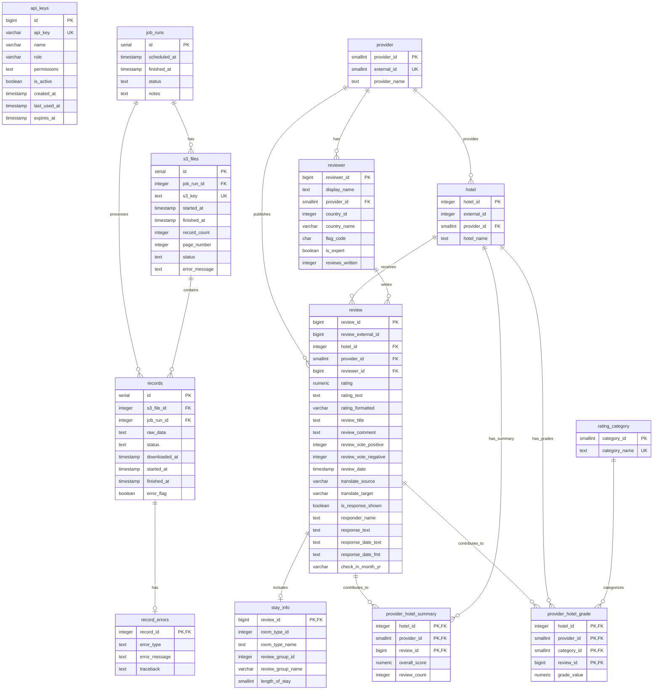

# Hotel Review System Database Diagram

## Entity Relationship Diagram (ERD)

## Database Schema Overview

### 1. **Authentication & Authorization**
- **`api_keys`**: Manages API key authentication with role-based access control
  - Supports different roles: ADMIN, OPERATOR, VIEWER, EXECUTOR
  - Tracks key usage and expiration

### 2. **Job & File Tracking System**
- **`job_runs`**: Tracks job execution lifecycle
  - Status: pending, running, success, failed
  - Timestamps for scheduling and completion

- **`s3_files`**: Manages S3 file processing
  - Links to job runs
  - Tracks processing status and record counts
  - Stores error messages for failed files

- **`records`**: Individual JSON records from S3 files
  - Links to both S3 files and job runs
  - Tracks processing status with timestamps
  - Stores raw JSON data

- **`record_errors`**: Error tracking for failed records
  - One-to-one relationship with records
  - Stores error type, message, and stack trace

### 3. **Core Business Entities**

#### **Reference Tables**
- **`provider`**: Hotel review providers (Agoda, Booking.com, etc.)
- **`rating_category`**: Rating categories (Cleanliness, Facilities, etc.)

#### **Core Entities**
- **`hotel`**: Hotel information with provider relationship
- **`reviewer`**: User information with provider relationship
- **`review`**: Individual hotel reviews
- **`stay_info`**: Additional stay details (room type, group, length)

#### **Aggregated Metrics**
- **`provider_hotel_summary`**: Overall hotel scores per provider
- **`provider_hotel_grade`**: Detailed category grades per hotel/provider

## Key Features

### **Data Integrity**
- Foreign key constraints ensure referential integrity
- Unique constraints prevent duplicate data
- Check constraints validate status values

### **Performance Optimization**
- Indexes on frequently queried columns
- Composite primary keys for aggregated tables
- Efficient relationship design

### **Scalability**
- Identity columns for auto-incrementing IDs
- Proper data types for different value ranges
- Flexible text fields for variable content

### **Audit Trail**
- Comprehensive timestamp tracking
- Error logging and debugging support
- Job execution history

## Usage Patterns

### **Data Ingestion Flow**
1. `job_runs` → `s3_files` → `records` → `record_errors` (if failures)
2. Records processed into: `hotel`, `reviewer`, `review`, `stay_info`
3. Aggregated into: `provider_hotel_summary`, `provider_hotel_grade`

### **Query Patterns**
- Hotel reviews by provider
- Reviewer activity tracking
- Error analysis and debugging
- Performance metrics aggregation
- API key authentication and authorization

This database design supports a comprehensive hotel review system with robust job processing, error handling, and role-based access control.